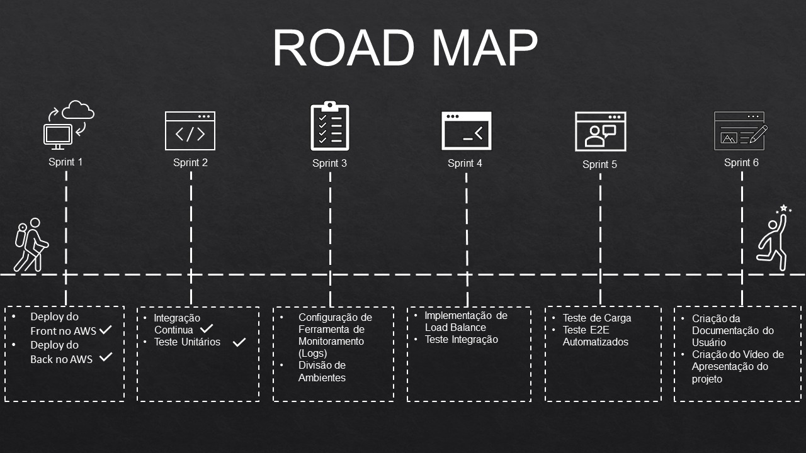

# Antenas DEVOPS

Este repositório é utilizado para mostrar as entregas para a disciplina de Laboratório de Projeto de Bando de Dados onde iremos implementar um conjunto de melhores práticas de desenvolvimento de software (Dev) e operações de TI (Ops) que é comumente chamado DevOps.

Professor: Eduardo Sakaue

Alunos:

- Bruno Akira Ota
- Gabriel Pereira Bastos
- Leticia Macedo Prudente
- Matheus Rocha da Silva
- Thaís Bitencourt de Meneses
- Vanessa Bessa Diogenes Castellano
- Yan Rodrigues de Azevedo

Repositórios:

Front-end: <https://github.com/mrocha98/antenas-front>

Back-end: <https://github.com/mrocha98/antenas-back>

## Road Map

## Entregas

### Sprint 01

- Deploy do back e do front na [AWS EC2](https://aws.amazon.com/ec2/?ec2-whats-new.sort-by=item.additionalFields.postDateTime&ec2-whats-new.sort-order=desc)
- [Criação de um arquivo docker-compose integrando MongoDB e NodeJs](https://github.com/mrocha98/antenas-back/blob/master/docker-compose.yml) para utilizarmos em desenvolvimento
- Criação de um banco em nuvem no [MongoDB Atlas](https://www.mongodb.com/cloud/atlas)

### Sprint 02

TODO

### Sprint 03

TODO

### Sprint 04

TODO

### Sprint 05

TODO

### Sprint 06

TODO

## Ferramentas utilizadas na disciplina

### AWS (EC2)

TODO

## GitHub Actions

TODO

### Docker

TODO

## Jest

TODO

## Cypress

TODO
